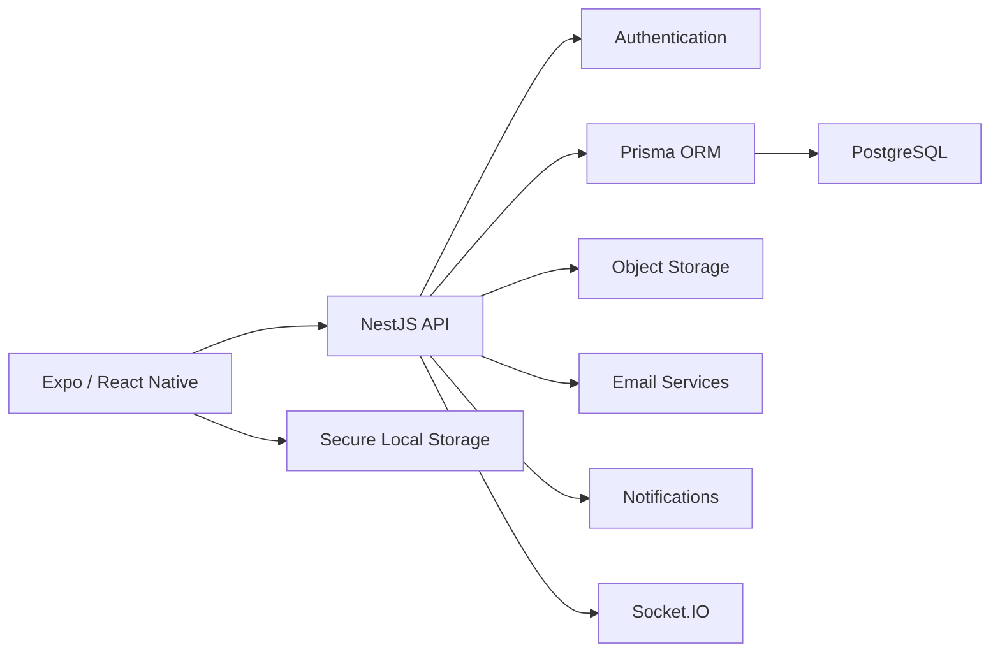

# Goaly

> **Public project showcase.** The implementation repository remains private while this repository presents the architecture and product scope.

## Overview

**Goaly** is a mobile personal-finance platform built around everyday financial organization: accounts, transactions, budgets, goals, recurring obligations and assisted data entry.

The system combines an **Expo / React Native** application with a formal **NestJS + PostgreSQL** backend architecture.

## Product Capabilities

- Accounts and financial movements
- Transfers
- Categories
- Budgets
- Savings goals
- Debts
- Recurring payments
- Subscriptions
- OCR-assisted input
- Voice-assisted input
- Recommendations
- Notifications
- Authentication
- Google OAuth integration path
- Password recovery
- Data export
- Account deletion

## Architecture

## Technology

| Area | Technologies |
|---|---|
| Mobile | Expo · React Native · TypeScript |
| State | Zustand |
| Backend | NestJS |
| ORM | Prisma |
| Database | PostgreSQL |
| Realtime | Socket.IO |
| Authentication | JWT · Google OAuth integration |
| Cloud Services | AWS SDK · S3 · SES |
| Testing | Jest · E2E Tests |
| Infrastructure | Docker |

## Engineering Highlights

### Mobile + Backend Separation

The project is structured as a mobile client backed by a formal API rather than placing all business logic in the application.

### Local / Guest Experience

Guest mode can preserve information locally, while authenticated sessions use the backend without silently falling back to local data when the server fails.

### Security-Oriented Mobile Storage

Authentication state is designed around secure device storage for sensitive tokens.

### Cloud-Ready Integrations

The backend contains integration paths for object storage, email delivery and third-party authentication.

### Quality Checks

The private project includes lint, typecheck, build, unit-test and end-to-end verification flows.

## Project Status

Goaly is an actively developed product architecture. Some external integrations require owner credentials and physical-device validation before they can be considered production-complete.

## Repository Strategy

Financial application code, authentication implementation and environment configuration remain private. This repository intentionally serves only as a public engineering showcase.

---

**Private source repository · Public FinTech/mobile case study**
