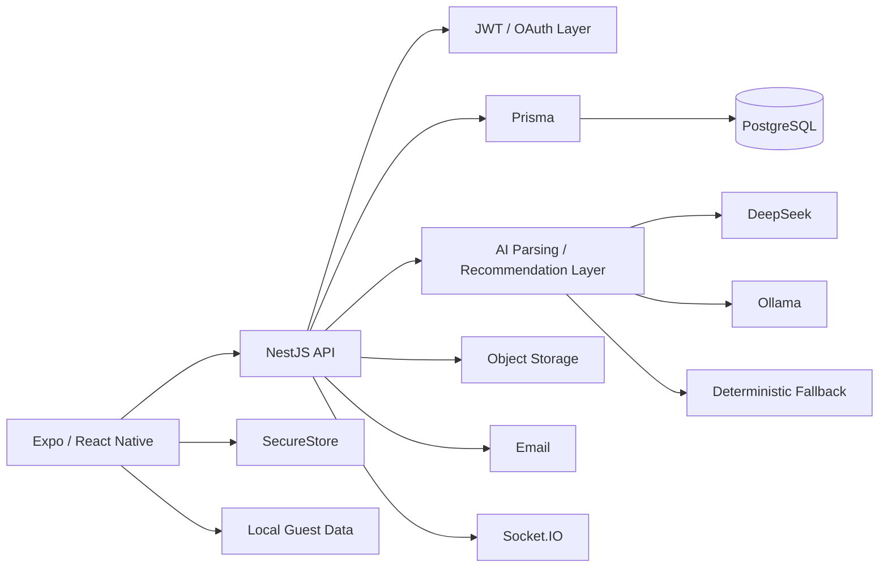

<div align="center">

# Goaly

### Personal Finance · Mobile · Backend · AI-Assisted Input

**Public engineering showcase — application source remains private**

[Architecture](./docs/ARCHITECTURE.md) · [Project status](./docs/STATUS.md)

</div>

---

## Overview

**Goaly** is a personal-finance mobile platform built around day-to-day financial organization.

The private project combines an **Expo / React Native** application with a **NestJS + Prisma + PostgreSQL** backend and local/cloud integration paths.

## Product Scope

Goaly covers:

- accounts
- transfers and movements
- categories
- budgets
- goals
- debts
- recurring payments
- subscriptions
- OCR-assisted entry
- voice-assisted entry
- recommendations
- notifications
- authentication and recovery
- export
- account deletion

## Architecture



## Product & UX Engineering

The private mobile app includes work around:

- multilingual UI
- onboarding that can be skipped
- new-user empty states with real CTAs
- guest/local usage
- authenticated API-backed usage
- mobile system-bar handling
- Google-auth UI flow
- recommendations as an optional feature rather than a blocking step

The guest and authenticated models are intentionally explicit: **an authenticated session does not silently fall back to local data if the backend fails.**

## AI-Assisted Input

Voice/movement parsing uses a layered provider strategy:

```text
DeepSeek
   ↓ if unavailable
Ollama local
   ↓ if unavailable
Deterministic heuristic
```

The app remains functional without a cloud AI key.

## Technology

| Area | Technologies |
|---|---|
| Mobile | Expo SDK 54 · React Native · TypeScript |
| State | Zustand |
| Backend | NestJS 11 |
| ORM | Prisma |
| Database | PostgreSQL |
| Realtime | Socket.IO |
| Security | JWT · Argon2 · Helmet · throttling |
| Cloud integration paths | AWS S3 · SES |
| AI | DeepSeek integration · Ollama fallback |
| Testing | Jest · E2E tests |
| Infrastructure | Docker |

## Quality & Verification

The private project includes:

- frontend typecheck
- lint
- Jest tests
- Expo Doctor/export checks
- backend lint/build/unit/E2E checks
- CI with PostgreSQL

A documented mobile UX phase closed with **typecheck, lint and 12/12 tests passing**.

## Engineering Decisions

**Offline/guest behavior is explicit.** Local guest data is a product mode, not a hidden fallback for backend failure.

**AI is optional.** The parsing/recommendation pipeline degrades from cloud AI to local AI to deterministic logic.

**External identity is configuration-dependent.** Google OAuth code exists, but correct production credentials must be supplied by the owner.

**Native changes require native rebuilds.** Changes affecting Android system UI are correctly tracked as rebuild-dependent rather than pretending they can ship through OTA alone.

## Current Status

The product has substantial mobile/backend implementation, but several external integrations still require owner credentials or final physical-device validation.

[See the implementation matrix →](./docs/STATUS.md)

## Why the Source Is Private

The source includes authentication, financial domain models, environment contracts and external integration configuration that are not appropriate for a public repository.

---

### What this project demonstrates

**Mobile product engineering · backend architecture · personal-finance domain modeling · graceful AI fallback · authentication · UX quality**
