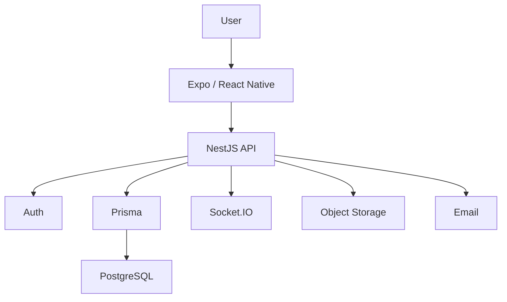

# Goaly — Architecture Notes

## Product Layers

1. **Mobile Client** — financial workflows and user interaction.
2. **API** — business logic and authenticated operations.
3. **Persistence** — relational financial data.
4. **Integrations** — storage, email, realtime and external identity.

## Logical Flow

## Design Considerations

- Guest/local and authenticated/server-backed modes are explicit.
- Backend failures should not silently change the application's data model.
- Sensitive tokens use secure device storage.
- Financial records are modeled relationally.
- External integrations are isolated behind service boundaries.
