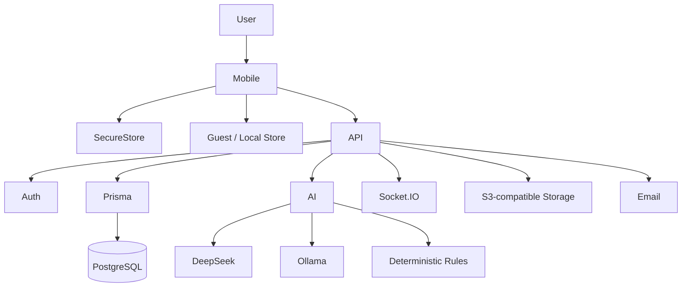

# Goaly — Architecture

## 1. Main Layers

### Mobile client

Expo/React Native application with Zustand state, secure storage and local guest-mode persistence.

### Backend API

NestJS service responsible for authenticated business operations.

### Persistence

Prisma over PostgreSQL.

### AI parsing/recommendation

Provider chain:

1. DeepSeek when configured
2. local Ollama
3. deterministic heuristic fallback

### Integrations

The backend contains paths for object storage, email, realtime and external authentication.

## 2. Diagram

## 3. State Boundary

The system deliberately distinguishes:

- guest/local data
- authenticated/server data

Backend failure does not silently switch an authenticated user into another data source.

## 4. Security Considerations

The private backend uses mechanisms including:

- JWT
- Argon2
- Helmet
- throttling
- server-side validation

The mobile layer uses secure storage for sensitive authentication material.

## 5. Production Boundaries

The private documentation explicitly identifies integrations that need owner-controlled production setup:

- Google OAuth credentials
- payment provider credentials
- email configuration
- push credentials
- physical-device validation

This architecture note describes the design without publishing environment values or operational secrets.
